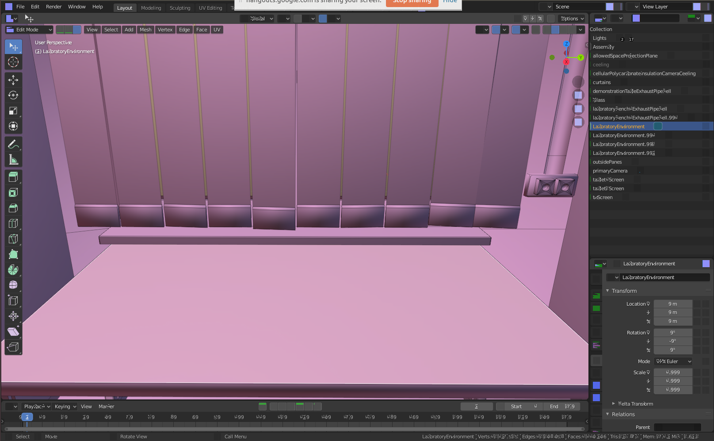

# Лабораторная работа 1

1. Создать 3D assets для окружения согласно скетчу ниже

2. Orbital Camera ограничена углом ??

3. Создать 3D assets для оборудования и материалов:

    * термометр (расположен на столе посередине)
    * измерительный цилиндр (расположен на столе посередине)
    * линейка (расположен на столе посередине)
    * планшет (ассистент) (расположен на подставке слева)
    * тетрадь для записи результатов (расположен на столе справа)

4. Планшет (ассистент) расположен в левой части сцены (отдельный сценарий)

5. Пользователь (П) заходит в виртуальную лабораторию, где он может:

    * взаимодействовать с объектами сцены (interactable property) с помощью мышки или тачскрина;
    * менять положение камеры в заданых сценой ограничениях (orbital camera position constrains);

    1. П взаимодейтсвует (мышка/тачскрин/VR) с планшетом (ассистент), планшет разворачивается на сцене и отображает первое задание (image):
        * "Рассмотреть шкалу термометра и заполнить первые пять столбцов Табл.1";
    2. П завершает ознакомление с первым заданием и с планшетом (ассистентом) нажатием на значок (image) и возвращается к главному виду сцены
    3. П взаимодейтсвует с объектом "термометр" и выбирает одно из доступных действий:
        * "Приблизить" (Magnify);
    4. Объект "термометр" разворачивается на сцене (image)
    5. П завершает взаимодейтсвие с объектом "термометр" нажатием на значок (image) и возвращается к главному виду сцены (вариант: взаимодействеие с объектом "тетрадь для записи результатов" через панель "быстрого доступа")
    6. П взаимодейтсвует с объектом "тетрадь для записи результатов" и выбирает одно из доступных действий:
        * "Открыть" (Open);
    7. Объект "тетрадь для записи результатов" разворачивается на сцене (image)
    8. П вводит с клавиатуры или выбирает из списка в Табл. 1:
        * 1-й столбец - выбирает из списка нужное значение (image);
        * 2-й столбец - выбирает из списка нужное значение (image);
        * 3-й столбец - вводит с клавиатуры;
        * 4-й столбец - вводит с клавиатуры;
        * 5-й столбец - вводит с клавиатуры;
    9. П видит ниже Табл.1 формулу с подставленными значениями из таблицы (image)
    10. Табл. 1 6-й столбец заполняется посчитаным зачением
    11. П завершает взаимодейтсвие с объектом "тетрадь для записи результатов" нажатием на значок (image) и возвращается к главному виду сцены
    12. П взаимодейтсвует с объектом "термометр" и выбирает одно из доступных действий:
        * "Приблизить" (Magnify);
    13. Объект "термометр" разворачивается на сцене (image)
    14. П взаимодейтсвует с объектом "термометр" перемещаясь по шкале нажатием на значок (image)
    15. П взаимодейтсвие с объектом "тетрадь для записи результатов" (вариант: из области "быстрого доступа")
    16. П вводит с клавиатуры в Табл. 1:
        * 7-й столбец - вводит с клавиатуры;
        * 8-й столбец - вводит с клавиатуры;
    17. П завершает взаимодейтсвие с объектом "тетрадь для записи результатов" нажатием на значок (image) и возвращается к главному виду сцены

6. Проверка таблицы результатов
